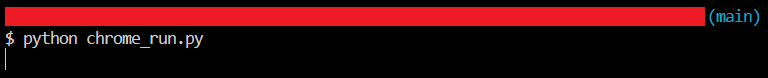
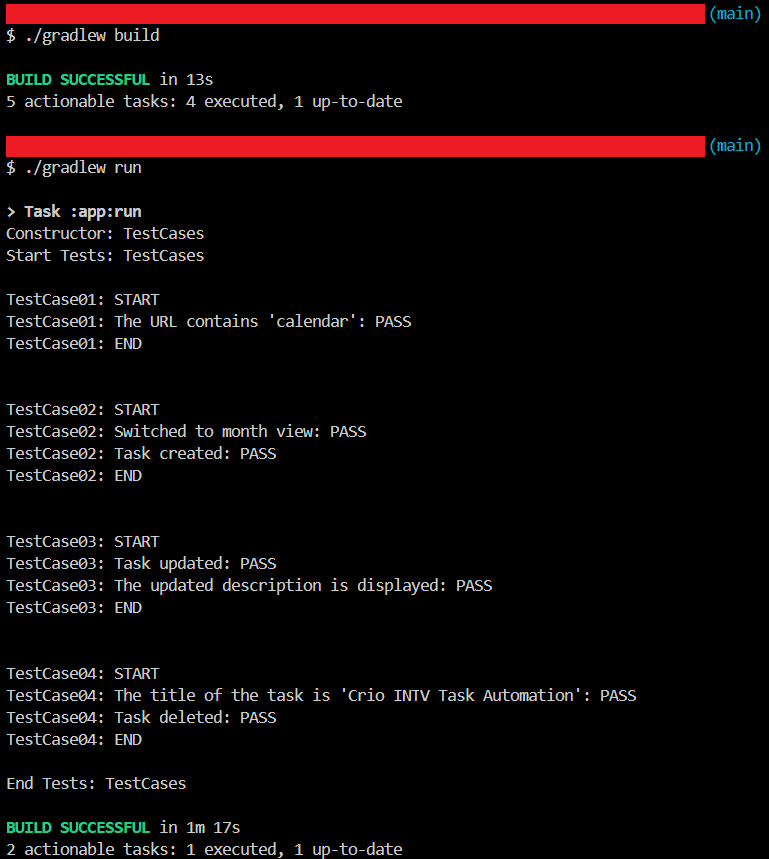

# Google Calendar Automation

`Selenium` `Dynamic Xpath`

---

During the course of this project automated Google Calendar to schedule, create, update, and delete Tasks on the Calendar and explored methods of having a signed google chrome Instance.

---

# Overview
During the course of this project automated Google Calendar to schedule, create, update, and delete Tasks on the Calendar and explored methods of having a signed google chrome Instance.

# Automating Google Calendar
## Scope of work
* Automated the following test cases:
    * Verify calendar home page
    * Verify calendar navigation and add task
    * Verify the task details updation
    * Verify the task deletion

## Skills used
`Selenium` `Dynamic Xpath`

---

# Screenshots

> python chrome_run.py

> Gradle build, gradle run
